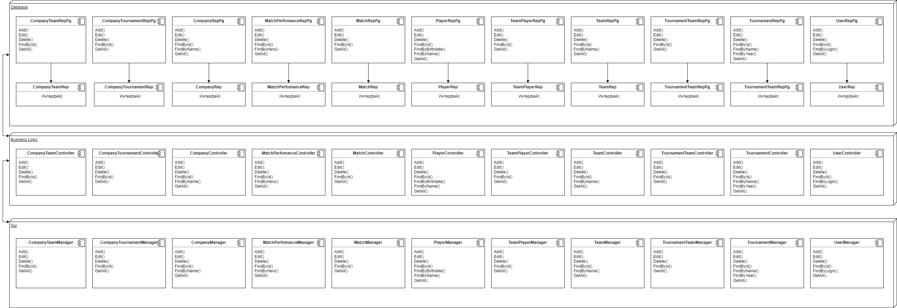

# Dota Pro Tracker

## Описание идеи проекта

Сегодня, в век высоких технологий, наравне с общеизвестными спортивными дисциплинами звучит слово «киберспорт» и привлекает интерес большого количества людей. Как и в любом виде спорта в киберспорте проводится множество турниров различного уровня во всех регионах с обширным количеством игроков, спонсоров и матчей внутри конкретного соревнования. Самой популярной и самой просматриваемой дисциплиной является Dota 2.

Многие зрители имеют любимые команды, фаворитов среди игроков и следят за их карьерой. Таким образом, существует потребность в сервисе, предоставляющем данные о турнирах, командах, внутриматчевую или глобальную статистику выступлений и другую сопутствующую информацию.
Целью данной работы является проектирование и реализация базы данных, содержащей информацию о киберспортивных матчах и командах в дисциплине Dota 2.

## Описание предметной области

### Краткое описание игрового процесса

Dota 2 представляет собой многопользовательскую игру в жанре MOBA ("многопользовательская онлайновая боевая арена"), в которой сражаются две команды по пять игроков. Одна команда играет за светлую сторону (англ. The Radiant), другая - за тёмную (англ. The Dire). Конечная цель каждого матча - уничтожить вражескую "крепость" (англ. Ancient), особый объект, принадлежащий противнику, и защитить собственную крепость. Подобно Defense of the Ancients, Dota 2 использует управление схожее с управлением в стратегиях в реальном времени и вид с расстояния, имитирующий изометрическую проекцию.

Каждый из десяти участников матча управляет одним персонажем, который называется героем; игроки выбирают по одному из 123 героев, каждый из которых имеет свою узнаваемую внешность, силы и слабости. В ходе матча игрок выполняет определённую роль, как, например, "керри" (англ. Carry) или "саппорт" (англ. Support), и герои могут по своим характеристикам лучше подходить для той или иной роли. В течение матча герой может получать очки опыта, зарабатывать золото, покупать и собирать предметы, которые усиливают его или дают дополнительные способности. «Керри» в начале матча относительно слабы, но по мере набора очков опыта становятся сильнее и получают доступ к способностям, позволяющим им легко побеждать врагов и в конечном счёте добиться победы для всей команды. Способности "саппортов" позволяют оказывать помощь союзникам - например, восстанавливать потерянные очки здоровья. Если очки здоровья героя снижаются до нуля - например, его одолевает в бою вражеский герой - герой в течение некоторого короткого времени считается "погибшим"; по окончании этого времени герой вновь появляется рядом с крепостью, и управляющий им игрок может возобновить игру. Уничтожение вражеского героя приносит его победителю большое количество очков опыта.

Каждый матч проходит на квадратной карте специального вида, где крепости обеих команд находятся в противоположных углах, а игроки рассредотачиваются по соединяющим эти крепости путям - "линиям" (англ. Lane). Помимо самих игроков, в игре принимают управляемые компьютером существа - "крипы" (англ. Creeps) и неподвижные строения - "башни" (англ. Towers), свои с каждой стороны; они также участвуют в сражении, атакуя вражеских героев, крипов и башни противника и тем самым помогая своей команде. Туман войны, покрывающий большую часть карты, не позволяет игрокам следить за передвижениями противника.

### Dota Pro Circuit

Dota Pro Circuit - профессиональные турниры организуются компанией Valve и её партнёрами, для определения команд, которые получат прямые приглашения на The International (главный турнир года).

После окончания The International 2017, на официальном сайте Dota 2 был анонсирован новый профессиональный сезон и запущена страница с информацией о турнирах сезона, а также текущих баллах команд и игроков.

Заработанные за сезон баллы будут определять статус команды перед The International и её шансы на получение прямого приглашения.

Важным изменением сезона стало разрешение тренерам команд участвовать в стадии выбора героев и стратегии во время матчей. После окончания стратегического времени тренеры должны оставлять команду.

Сезон состоит из 22 оффлайн турниров по всему миру. Турниры делятся на 9 мейджоров (главный) и 13 майноров (второстепенный).

На каждом мейджоре разыгрывается 1500 баллов и 1.000.000\$, кроме China Dota2 Supermajor на 2250 баллов и 1.500.000\$, а на майнорах разыгрывается 300 баллов и 300.000\$, кроме Galaxy Battles II: Emerging Worlds на 400 баллов и 400 000\$ впоследствии этот турнир был лишён статуса майнора.

Баллы выдаются всем пяти игрокам команды. К примеру, если команда получила за турнир 75 баллов, то и каждый её игрок получит по 75 баллов. Если игрок переходит в другую команду, то его баллы переходят вместе с ним. В счёт рейтинга команды идут показатели трёх игроков, у которых наибольшее количество баллов.

Турниры в рамках DPC проводятся в формате Double Elimination.

## Обзор существующих сервисов

| Название сервиса | Open Source | Модель распространения                          | Подробная послематчевая статистика | Турнироориентированность | Язык       | Новостной раздел | API | Система рекомендаций и предсказаний | Онлайн-трансляции |
| ---------------- | ----------- | ----------------------------------------------- | ---------------------------------- | ------------------------ | ---------- | ---------------- | --- | ----------------------------------- | ----------------- |
| DOTABUFF         | Нет         | Базовый функционал бесплатный, Premium подписка | Нет                                | Нет                      | Английский | Нет              | Нет | Нет                                 | Да                |
| OpenDota         | Да          | Полностью бесплатный                            | Да                                 | Нет                      | Английский | Нет              | Да  | Да                                  | Нет               |
| Cybersport       | Нет         | Нативная реклама                                | Нет                                | Да                       | Русский    | Да               | Нет | Нет                                 | Да                |

Список подобных сервисов не исчерпывается приведенными выше решениями. Их существует гораздо больше, каждое из которых имеет свои преимущества и недостатки.

## Обоснование целесообразности и актуальности проекта

С каждым годом призовые фонды турниров становятся все больше. Более того, киберспортивные первенства проходят даже в пределах конкретных организаций, школ, колледжей, университетов и других объединений, которые в свою очередь нельзя подробно изучить в одном месте.

Российская команда Team Spirit стала победителем The International 10, что существенным образом сказалось на популярности и интересе к киберспортивной составляющей Dota 2. 

Таким образом, разрабатываемое приложение предложит удобный инструмент для просмотра статистики по киберспортивным турнирам, с возможностями добавления своих и составления отчетов за выбранный период.

## Описание типа приложения и выбранного технологического стека

Тип приложения: **Desktop**

Технологический стек: **Go + PostgreSQL**

В качестве СУБД выбор сделан в строну PostgreSQL.

|  | Oracle | MySQL | Microsoft SQL Server | PostgreSQL |
| --- | --- | --- | --- | --- |
| Простота в использовании | + | + | + | + |
| Бесплатная | - | + | - | + |
| Безопасность данных | + | - | + | + |
| Поддержка стандарта SQL | + | - | + | + |
| Поддержка хранимых процедур и триггеров | + | + | + | + |
| Кросплатформенность | + | + | - | + |

В качестве языка программирования выбор сделан в сторону **Go**. Этот язык имеет удобные пакеты для работы с PostgreSQL, а также в перспективе можно перевести приложение в Web. 

## Верхнеуровневое разбиение на компоненты

## ER - диаграмма

## UML диаграммы классов для двух отдельных компонентов - компонента доступа к данным и компонента с бизнес-логикой

## Сущности БД

